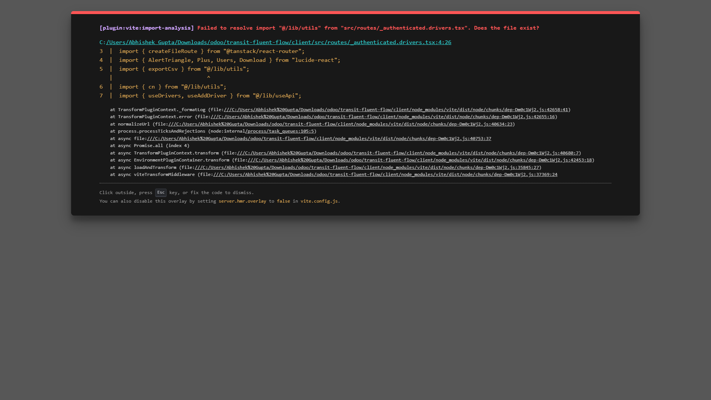
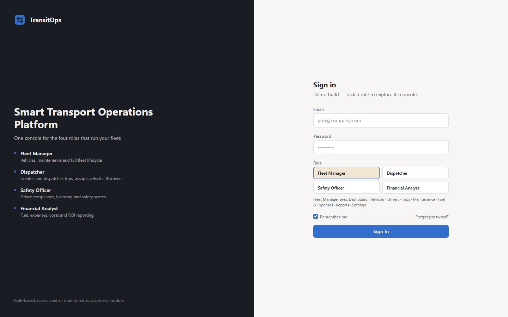
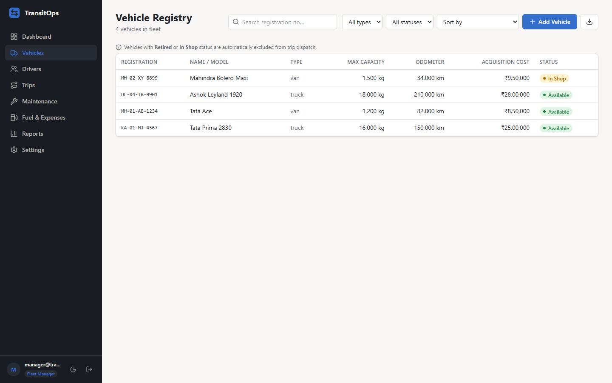
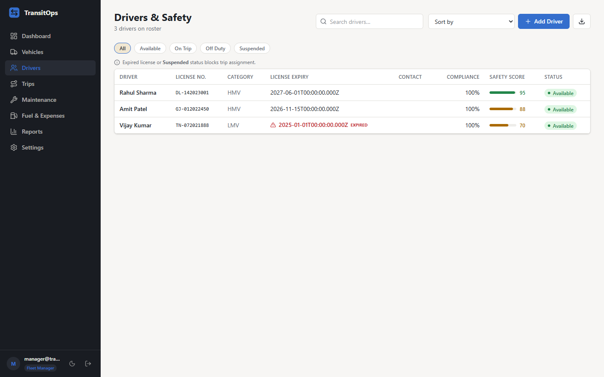
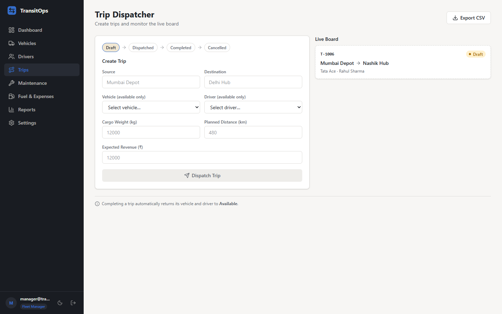
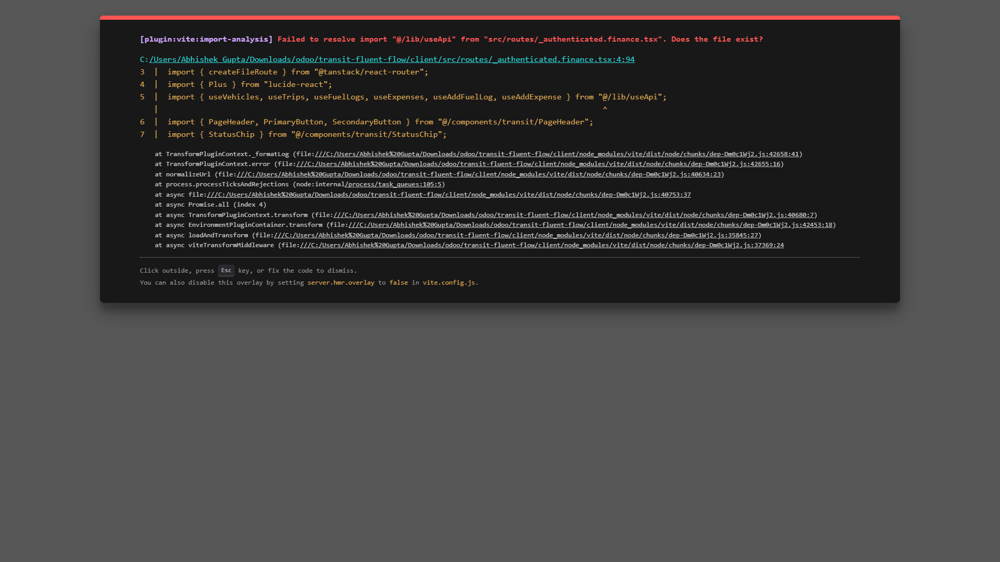
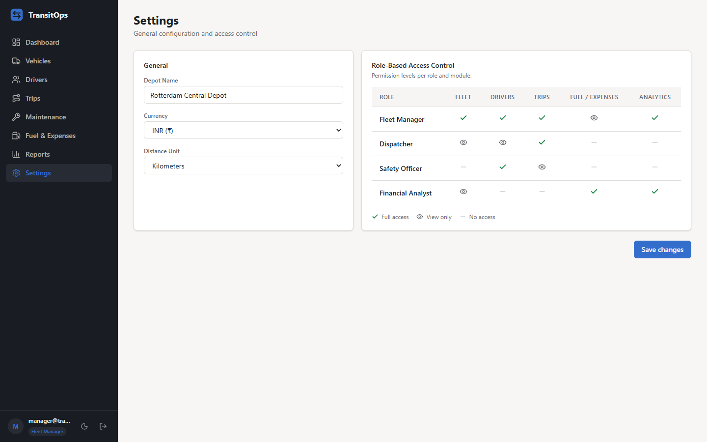

# 🚚 TransitOps — Smart Transport Operations Platform

<div align="center">
  
</div>

<br />

**TransitOps** is an end-to-end transport operations platform that digitizes vehicle, driver, dispatch, maintenance, and expense management while enforcing strict business rules and providing real-time operational insights. Built for the **Odoo Hackathon 2026**.

## 📖 Description

Many logistics companies still rely on spreadsheets and manual logbooks to manage their transport operations. This leads to scheduling conflicts, underutilized vehicles, missed maintenance, and poor operational visibility.

TransitOps solves this by providing a centralized platform that manages the complete lifecycle of transport operations—from vehicle registration and driver management to dispatching, maintenance, fuel logging, and analytics. It enforces mandatory business rules automatically so that dispatchers cannot assign suspended drivers or vehicles currently in the shop.

---

## 📸 Application Flow & Features

<details open>
<summary><b>0. Login — Role-Based Access Control</b></summary>
<br/>

Secure login with four distinct roles: Fleet Manager, Dispatcher, Safety Officer, and Financial Analyst. Each role sees only the modules it needs.
</details>

<details open>
<summary><b>1. Dashboard — Operational Overview</b></summary>
<br/>

Live KPI cards showing total vehicles, active trips, maintenance alerts, and this month's fuel spend. Charts update in real-time.
</details>

<details open>
<summary><b>2. Vehicle Registry</b></summary>
<br/>

Maintain a master list of all fleet assets with status tracking: <code>Available</code>, <code>On Trip</code>, <code>In Shop</code>, or <code>Suspended</code>. Payload capacity and odometer are tracked per vehicle.
</details>

<details open>
<summary><b>3. Driver Management</b></summary>
<br/>

Track driver certifications, license expiry, and safety scores. The system prevents dispatchers from assigning suspended drivers or those with expired licenses.
</details>

<details open>
<summary><b>4. Trip Dispatching</b></summary>
<br/>

Create and dispatch trips with automatic business-rule enforcement: payload must not exceed vehicle capacity; driver and vehicle must both be <code>Available</code>. Status transitions are atomic.
</details>

<details open>
<summary><b>5. Maintenance Workflow</b></summary>
<br/>

Log maintenance records and automatically mark vehicles as <code>In Shop</code> to prevent unsafe dispatching until service is complete.
</details>

<details open>
<summary><b>6. Fuel & Expenses</b></summary>
<br/>

Track fuel consumption and operational costs per vehicle and trip, with automated cost-per-km calculations and CSV export.
</details>

<details open>
<summary><b>7. Reports & Analytics</b></summary>
<br/>

Fleet Utilization, Fuel Efficiency, and per-vehicle ROI calculations across your whole fleet with interactive Recharts visualizations.
</details>

<details open>
<summary><b>8. Settings</b></summary>
<br/>

Manage organization profile, notification preferences, and system configuration.
</details>

---

## 🧪 Test Workflow (End-to-End Pointers)

Follow this workflow to verify all mandatory business rules from the UI:

### Part 1: Registration & Validation
- **Pointer 1:** Log in as **Fleet Manager** → **Vehicles** tab. Add `Van-05` with max capacity `500 kg`. Verify `Available` status appears.
- **Pointer 2:** Switch to **Safety Officer** → **Drivers** tab. Register driver `Alex` with a valid license.
- **Pointer 3:** Switch to **Dispatcher** → **Trips** tab. Try creating a trip for `Van-05` + `Alex` with Cargo Weight `600 kg`. ❌ System blocks it (exceeds capacity).

### Part 2: The Dispatch Lifecycle
- **Pointer 4:** Correct cargo to `450 kg` (≤ 500 kg) and create the trip. ✅
- **Pointer 5:** Dispatch the trip. Both `Van-05` and `Alex` flip to **`On Trip`** globally.
- **Pointer 6:** Try creating a new trip — neither `Van-05` nor `Alex` appear in dropdowns.
- **Pointer 7:** Complete the trip with final odometer + fuel. Both return to **`Available`**.

### Part 3: Maintenance & Finance
- **Pointer 8:** As **Fleet Manager** → **Maintenance**. Log an Oil Change for `Van-05`. It instantly becomes **`In Shop`** and disappears from dispatcher dropdowns.
- **Pointer 9:** As **Financial Analyst** → **Reports**. Operational costs and fuel efficiency update dynamically from the completed trip and maintenance record.

---

## 🚀 How to Run Locally

### Prerequisites
- Node.js 20+
- PostgreSQL database (local or hosted — Railway, Render, Neon all work)

### 1. Start the Backend
```bash
cd server
npm install

cp .env.example .env
# Set DATABASE_URL and JWT_SECRET in .env

npx prisma migrate dev --name init
npm run seed

npm run dev
# API running at http://localhost:4000
```

### 2. Start the Frontend
```bash
cd client
npm install
npm run dev
# UI running at http://localhost:5173
```

> The Vite dev server proxies `/api/*` → `http://localhost:4000` automatically.

### 3. Demo Accounts

Use password **`demo1234`** for all accounts:

| Role | Email |
|------|-------|
| Fleet Manager | `manager@transitops.dev` |
| Dispatcher | `dispatcher@transitops.dev` |
| Safety Officer | `safety@transitops.dev` |
| Financial Analyst | `finance@transitops.dev` |

---

## 🛠️ Tech Stack

| Layer | Technology |
|-------|-----------|
| Frontend | React 19, Vite, Tailwind CSS v4, shadcn/ui, Recharts |
| Backend | Node.js, Express.js, Prisma ORM |
| Database | PostgreSQL |
| Auth | Custom JWT + RBAC middleware |
| Language | TypeScript (end-to-end) |
